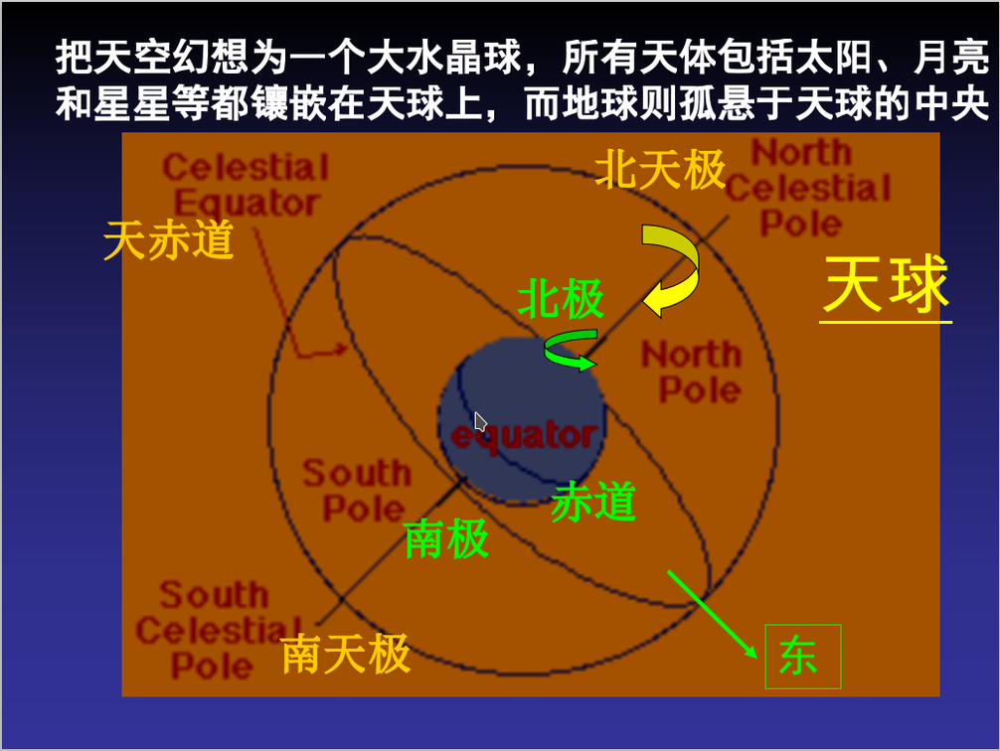

# 大作业选题：TOLA 射电干涉阵列

提示：如果你无法渲染其中的公式，请阅读 `README.pdf`，两者内容相同。

## 作业背景
射电干涉阵成像，是通过利用阵列中各个射电望远镜接收并测量自身所在位置的电场，再综合望远镜所采集到的数据，对天空的亮度分布（天图）进行重建的过程。

要进行干涉测量，需要保证信号是被准确地采集的，例如各个观测站点必须同时（指经典的"同时"）以同样的模式进行采集。

假设天球（可参见附录）上存在一个射电源，这个源将持续地辐射电磁波，并被位于地球上的台站所接收。各个台站接收到的源电场信号将会由于光的传播而存在由源的方向矢量 $(l, m, \sqrt{1-l^2-m^2})​$和台站的位置共同决定的时间延迟。


*台站接收平行光，由相对位置引入的延迟*

进一步地说，台站间接收同一个电场信号的相对时间延迟，是由 $(l, m, \sqrt{1-l^2-m^2})$ 和台站间相对位置（基线）$(u, v, w)$共同决定的。

$$
\left[
	\begin{matrix}
		u_1 & v_1 & w_1 \\
		u_2 & v_2 & w_2 \\
		u_3 & v_3 & w_3
	\end{matrix}
\right]
*
\left[
	\begin{matrix}
		x \\
		y \\
		z
	\end{matrix}
\right]
=
\left[
	\begin{matrix}
		\tau_1 \\
		\tau_2 \\
		\tau_3
	\end{matrix}
\right]
*
c
$$

TOLA 旨在清华校园内建造一个小型射电干涉阵，目前已经有两台基站运行。

这部分大作业的目标是，模拟生成由观测台站接收的信号。数据流程可见 `pipeline.pdf`，下面对流程的每个部分都有详细的说明。

### 输入数据

所有的输入数据存放在 `data` 文件夹下，因此请不要随意改动这个文件夹下的内容。它们包括：

1. 射电源辐射的信号是满足标准正态分布的随机数的某一个频段，频段由中心频率和带宽来表示（见`bandwidth.csv`）；
2. 定义采样率和采样时间 (`sample.csv`)、光速 (`speed_of_light.csv`)、源相关参数 (`sources.csv`)和台站相关参数 (`stations.csv`)，可以得到各个台站接收的各个源辐射的电场，而实际接收的电场则是由这些单独的电场叠加得到；
3. 各个台站启动采集的时间有偏差，因此总的收集的信号存在额外的时间偏移，台站们时间偏移的分布是高斯分布，分布的标准差被定义在 `ostrength.csv`。

### 输出数据
输出数据至少几百`MB`，较大，不适合使用默认的 Git 来存储。请不要把输出数据加入 `commit`。

### 参考资料

* 《信号与系统》（傅里叶变换、数字滤波器部分）
* 《Synthesis Imaging in Radio Astronomy II》

## 作业要求（功能部分）

### Makefile

本次作业提供了 `Makefile`，最终助教也将使用 `Makefile` 进行测试。需要注意，你在编写所有程序文件时，都应该使用 `make` 给程序传入的参数（来自 `sys.argv`），而非硬编码下面提到的文件名、台站数量、源数量等信息；否则，你可能无法通过测试。

在本目录中运行 `make -n` 即可看到实际运行的命令，这或许能帮助你开发。

### 基本要求

作业功能部分（占80分）的基础要求分成以下几部分，完成各个任务即可拿到相应分数：

|    任务（程序名）     | 分数 |
| --------------------- | ---- |
| oscillation.py        | 25   |
| random_offset.py      | 10   |
| plot_wave.py          | 10   |
| plot_wave_spectrum.py | 10   |
| superposition.py      | 15   |
| superimpose.py        | 10   |


#### `oscillation.py`

读取 `data/sources.csv, data/bandwidth.csv, data/sample.csv` 文件中的配置，生成从 -0.5s 开始，给定长度 $T​$ 和采样率 $F​$ (`data/sample.csv`)下台站1（$j = 1​$）分别接收的各个源 $i​$ 的信号 $A_{i1}​$。

例如：`sample.csv` 中定义采样时间 $T$ 为3s时，你生成的数据对应的时间应为 $[-0.5, 2.5)s$。

通过对标准高斯分布 (均值为0，标准差为1) 采样取得长为 $TF$ 的时间序列，再使用 `data/bandwidth.csv` 定义的频率段进行带通滤波得到对应频段（即对应源）的信号。

输出文件为`waves.h5`, 它包含了各个信号对应的时间线以及信号：

| Time           | $A_{11}$         | $A_{21}$         | $\dots$ | $A_{N1}$         |
| -------------- | ---------------- | ---------------- | ------- | ---------------- |
| $-0.5$         | $A_{11}[0]$      | $A_{21}[0]$      | $\dots$ | $A_{N1}[0]$      |
| $-0.5+1/F$     | $A_{11}[1]$      | $A_{21}[1]$      | $\dots$ | $A_{N1}[1]$      |
| $\dots$        | $\dots$          | $\dots$          | $\dots$ | $\dots$          |
| $-0.5+(T-1/F)$ | $A_{11}[TF - 1]$ | $A_{21}[TF - 1]$ | $\dots$ | $A_{N1}[TF - 1]$ |

实际保存的数据不需要描述性的第一行和第一列。它们需要被保存在 dataset `Waves` 里，是一个 `(TF, N)` 的 float 数组，其中 $N$ 是源的个数。

其物理意义是从 $-0.5$s 开始，各个源开始辐射电磁波，并且可以被1号台站接收（其余台站可能提前或延后接收到）；到 $T-0.5$s，各个源停止辐射，1号台站不能接收到信号（其余台站可能提前或延后停止）。

#### `random_offset.py`

读取 `data/ostrength.csv` 和 `data/stations.csv` 来计算台站时间相对于自身理想状态的偏移的随机数。最终得到各个台站各自的随机时间偏移，保存在 `offset.csv` 中，共 $M​$ 行，格式如下（注意实际数据需要更多的有效数字）：

```
1,0.001
2,-0.232
...
M,0.002
```

#### `superposition.py`

读取 `waves.h5` 和 `data/stations.csv, data/speed_of_light.csv, data/sample.csv`，利用 `wave.h5`，考虑各基站位置不同造成的时间偏移，进一步生成 $A_{ij} (j>1)​$，并叠加得到各个台站应当接收到的信号 $S_j=\sum_i A_{ij}​$。

输出 `ideal_signal.h5` 文件，文件的内容是各个台站在 $[-0.5, T-0.5)$s 中接收到的总信号。

| Time           | $S_{1}$         | $S_{2}$         | $\dots$ | $S_{M}$         |
| -------------- | --------------- | --------------- | ------- | --------------- |
| $-0.5$         | $S_{1}[0]$      | $S_{2}[0]$      | $\dots$ | $S_{M}[0]$      |
| $-0.5+1/F$     | $S_{1}[1]$      | $S_{2}[1]$      | $\dots$ | $S_{M}[1]$      |
| $\dots$        | $\dots$         | $\dots$         | $\dots$ | $\dots$         |
| $-0.5+(T-1/F)$ | $S_{1}[TF - 1]$ | $S_{2}[TF - 1]$ | $\dots$ | $S_{M}[TF - 1]$ |


它们被保存在 dataset `IdealSignals` 里，同样去除第一行和第一列，为一个 `(TF, M)` 的 float 数组。

#### `plot_wave.py`

读取 `waves.h5`，`ideal_signal.h5` 和 `data/sample.csv`, 画出信号的时域波形。其中包括：

1. 1号源在1号台站处的 $[0, 10)\mu \text{s}$ 的时域波形;
2. 2号源在1号台站处的 $[0, 10)\mu \text{s}$ 的时域波形;
3. 3号源在1号台站处的 $[0, 10)\mu \text{s}$ 的时域波形;
4. 1号台站的 $[0, 10)\mu \text{s}$ 的时域信号。

它们应当按照顺序（左上->右上->左下->右下）地布置在一张图片中，并有必要的标题和标注，其中横坐标单位为 $\mu \text{s}$。

####  `plot_wave_spectrum.py`

读取 `waves.h5` `ideal_signal.h5` 和 `data/sample.csv`, 画出信号的频域波形（即时域信号经过 FFT 以后的结果），只需要幅度谱。图中需要包括：

1. 1号源在1号台站处的 $[0, 10)\mu \text{s}$ 的频域幅度谱;
2. 2号源在1号台站处的 $[0, 10)\mu \text{s}$ 的频域幅度谱;
3. 3号源在1号台站处的 $[0, 10)\mu \text{s}$ 的频域幅度谱;
4. 1号台站的 $[0, 10)\mu \text{s}$ 的频域幅度谱。

它们应当按照顺序（左上->右上->左下->右下）地布置在一张图片中，并有必要的标题和标注，其中横坐标单位为 $\text{Hz}$。

#### `superimpose.py`

读取 `ideal_signal.h5` 和 `offset.csv`，生成理想信号在 `offset.csv` 中定义的时间偏移下得到的模拟结果。

设 $X$ 是 $[0, T-1)$ s 的采样个数，即 $X=(T-1)F$。输出为各个台站接收的信号中 $[0, T-1)$ s 的部分，它作为 `(X, M)` 的 float 数组，保存在 `signal.h5` 文件的 dataset `Signals` 中。


| Time           | $S_{1}$         | $S_{2}$         | $\dots$ | $S_{M}$         |
| -------------- | --------------- | --------------- | ------- | --------------- |
| $-0.5$         | $S_{1}[0]$      | $S_{2}[0]$      | $\dots$ | $S_{M}[0]$      |
| $-0.5+1/F$     | $S_{1}[1]$      | $S_{2}[1]$      | $\dots$ | $S_{M}[1]$      |
| $\dots$        | $\dots$         | $\dots$         | $\dots$ | $\dots$         |
| $-0.5+(T-1/F)$ | $S_{1}[X - 1]$ | $S_{2}[X - 1]$ | $\dots$ | $S_{M}[X - 1]$ |

### 提高要求

提高要求为加分项，至多可加 20 分。你可以自由发挥，一些可选项为：

1. 引入各基站间互相独立的白噪声干扰
2. 考虑各基站时钟频率的缓慢漂移，进行模拟
3. 在程序运行过程中输出友好的提示信息（如处理进度）
4. 增强程序的鲁棒性，添加完善的错误处理（如文件格式不正确、不存在文件等）
5. 让程序可以利用Makefile中定义的各个文件，自如地生成任意规模的数据，而不需要增加太多代码
6. 增加程序运行的效率

如果你实现了任何提高要求，请在实验报告中详细说明你的工作，这将作为评分的依据。

## 附录：天球

[天球](https://en.wikipedia.org/wiki/Celestial_sphere)，是在天文学和导航上想出的一个与地球同圆心，并有相同的自转轴，半径无限大的球。

天空中所有的物体都可以当成投影在天球上的物件。地球的赤道和地理极点投射到天球上，就是天球赤道和天极。天球的示意图如下图所示：


*天球示意图*

受观测的天体都被认为存在于天球上，因此它们是相当理想的远场源。由于一段射电望远镜观测的时间通常只会持续数分钟，除了计算的开销难以承受以外，还因为在观测时需要保持天球上的天体的位置不因为地球自转而发生位移。因此在单次观测中，天体在天球上静止地分布，只有两个自由度。

我们可以简单地以地球质心为原点，沿天赤道和南北天极建立一个直角坐标系，因此每个源的位置都可以被容易地用一个方向矢量来描述--这个方向矢量是源辐射到地球上的电磁波的波矢量方向。与此同时，各个观测台站的位置也能用这个坐标系描述，以便进行接下来的计算。
